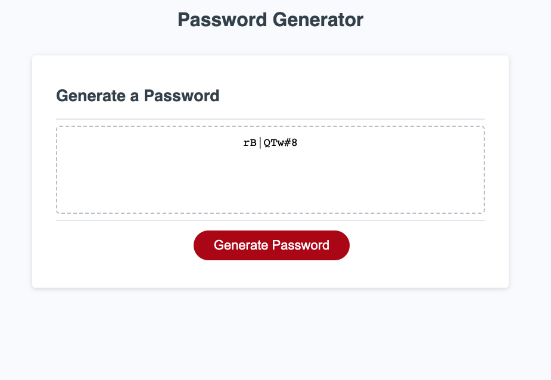

# Password Generator

The Password Generator project is a website I built to create randomly generated passwords to help provide greater security for users. Password criteria is chosen by the user. At the end, a randomly generated password will be displayed based on the user's criteria.

## Table of Contents

- [Description](#description)
- [Visuals](#visuals)
- [Support](#support)

## Description

This password generator was made to help give employees and employers a resource for greater password security. The password generator program is initialized by clicking on the "Generate Password" button. Once initialized, the program will confirm the password's criteria and prompt the user for a length. The user's inputs are then saved and used to generate a random password. All selected character types will be included. If no character types are selected, then no password will be generated and the user can retry.

## Visuals

## Support

If you encounter any issues with the password generator, please reach out! My email is daniel.barto@gmail.com. Thank you!